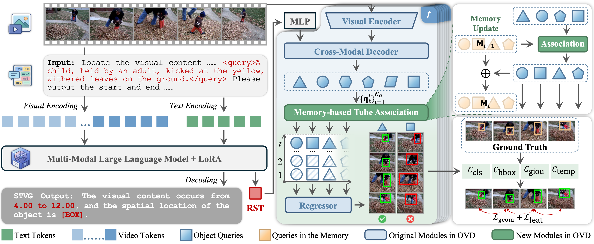
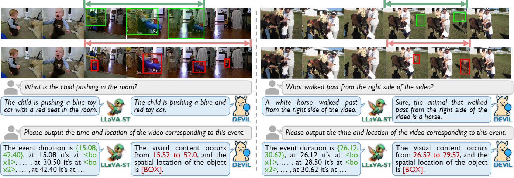
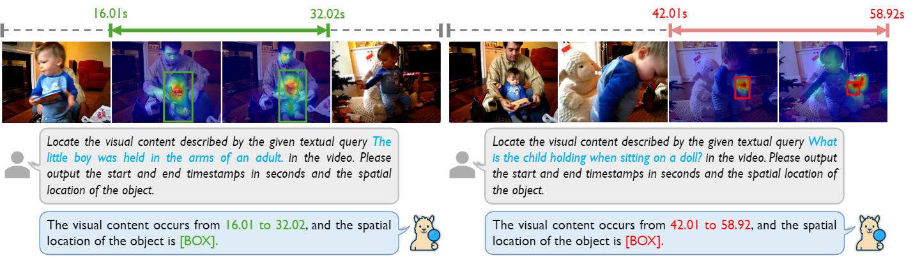
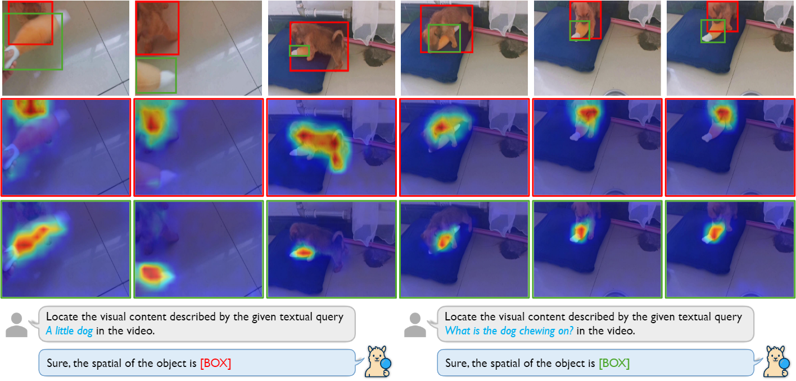
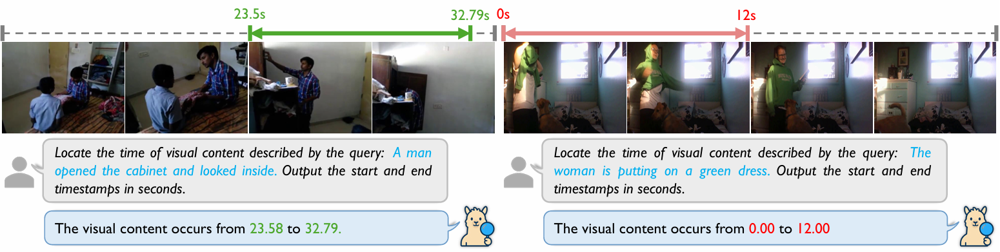
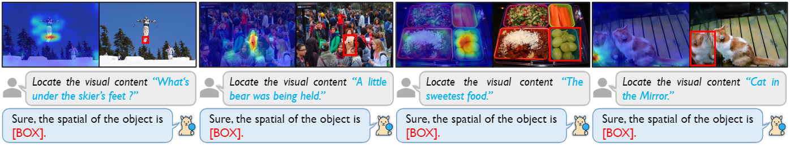
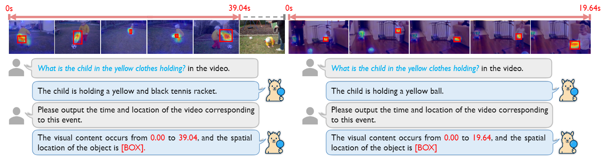
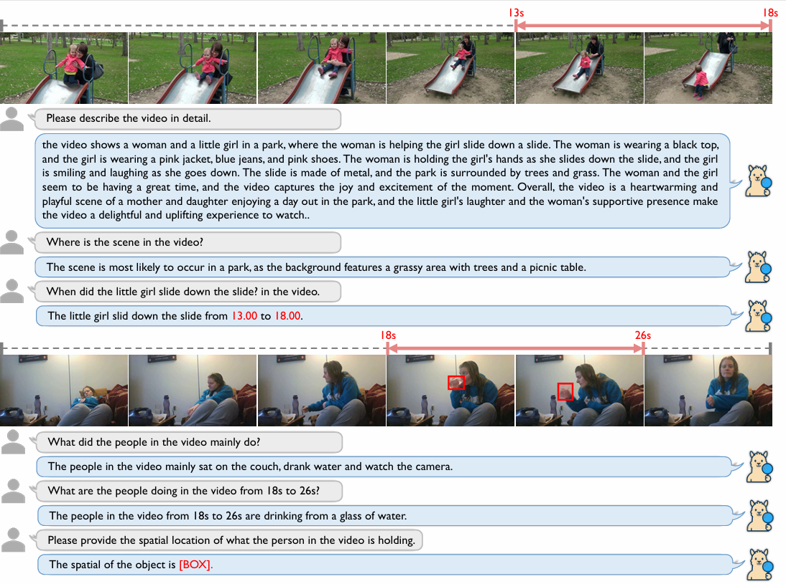

# DeViL
<p align="center">
  
</p>


# 1+1 > 2 : Detector-Empowered Video Large Language Model for Spatio-Temporal Grounding and Reasoning</h2>


[Shida Gao](https://github.com/gaostar123), 
[Feng Xue](https://scholar.google.com/citations?user=66SeiQsAAAAJ)\*, 
[Xiangfeng Wang](https://github.com/sweetsora233)\*, 
[Anlong Ming](https://scholar.google.com/citations?user=y5kFLCwAAAAJ&hl=en)<sup>✉</sup>, 
[Teng Long](https://scholar.google.com/citations?user=5Iv3ul0AAAAJ&hl=en), 
[Yihua Shao](https://scholar.google.cz/citations?user=lH6YmOUAAAAJ&hl=zh-CN), 
[Haozhe Wang](https://scholar.google.com/citations?hl=zh-CN&user=V96YGIMAAAAJ), 
[Zhaowen Lin](https://teacher.bupt.edu.cn/linzhaowen/zh_CN/index.htm), 
[Wei Wang](https://www.linkedin.com/authwall?trk=bf&trkInfo=AQFIFp8Qre3JwwAAAZrx02d4KQguZTBtrJhFt03M85mSxLu5O0g15lpMNPQ-0kYdcuVhLBwDxGCJq06cFl-rfrAaStunjatHaYbOdO-PppYbom7iGnsK4-4xhaoE5k_TEdp7ioo=&original_referer=&sessionRedirect=https%3A%2F%2Fwww.linkedin.com%2Fin%2F%25E4%25BC%259F-%25E7%258E%258B-ba9945376%3Ftrk%3Dcontact-info), 
[Nicu Sebe](https://scholar.google.it/citations?user=stFCYOAAAAAJ&hl=en)

\* Equal contribution. <sup>✉</sup> Corresponding author.


<a href='#'></a>
<a href=''></a>

## 📰 News

## ✅ TODO
- [ ] Release model checkpoints and datasets
- [ ] Integrate reinforcement learning to strengthen instruction following and grounding robustness
- [ ] Extend the pipeline to multi-object spatio-temporal video grounding

## 📝 Abstract
Spatio-temporal grounding and reasoning aims to locate the temporal segment and spatial region of an event in a video given a user query, while also reasoning about semantics such as causality, temporal order, and action relationships. To achieve this, current MLLMs primarily treats bounding boxes as text tokens and generates them autoregressively. However, such autoregressive spatial decoding leads to very-long output sequences, causing spatial errors to accumulated over time and the localization results to progressively drift across a video. To address this, we present a Detector-Empowered Video LLM, short for <strong>DEViL</strong>, which couples a Video LLM with an open-vocabulary detector (OVD). Specifically, the MLLM and detector are connected via a reference-semantic token (RST) that distills the user query into a rich semantic representation. Unlike tokens that merely serve as spatial prompts or segmentor switches, the RST functions as both a control signal and a replacement for the OVD's text embedding, enabling end-to-end learning of both referential understanding and spatial localization. Furthermore, we propose a tube-mined temporal regularization (TTReg) within OVD, which drives the OVD to generate temporally-consistent queries for target objects, thereby ensuring effective temporal association. Experiments demonstrate that DEViL achieves strong performance across various fine-grained video understanding tasks, particularly STVG and GroundedVQA.

## 🔎 Framework


### Visualization

#### Compare with other methods
<p align="center">

</p>

#### Spatial Temporal Video Grounding (STVG)
<p align="center">

</p>

#### Spatial Video Grounding (SVG)
<p align="center">

</p>

#### Temporal Video Grounding (TVG)

<p align="center">

</p>

####  Referring Expression Comprehension (REC)
<p align="center">

</p>

####  Grounded Visual Question Answering (GQA)
<p align="center">

</p>

####  Video Conversation
<p align="center">

</p>

# Citation

If you use our work or our implementation in this repo, or find them helpful, please consider giving a citation in the following format.

```

```

# Acknowledgements

We sincerely thank the following projects for their contributions to this work:

- [VideoLLaMA3](https://github.com/DAMO-NLP-SG/VideoLLaMA3)
- [GroundingDINO](https://github.com/IDEA-Research/GroundingDINO) 
