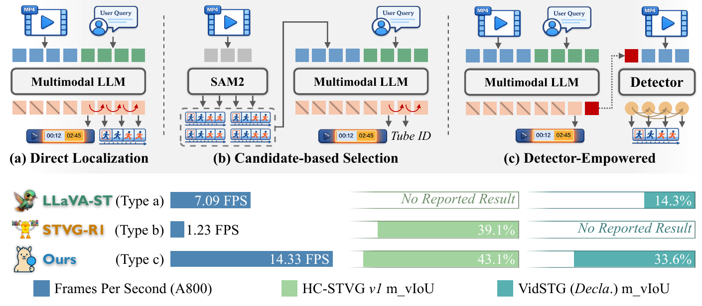
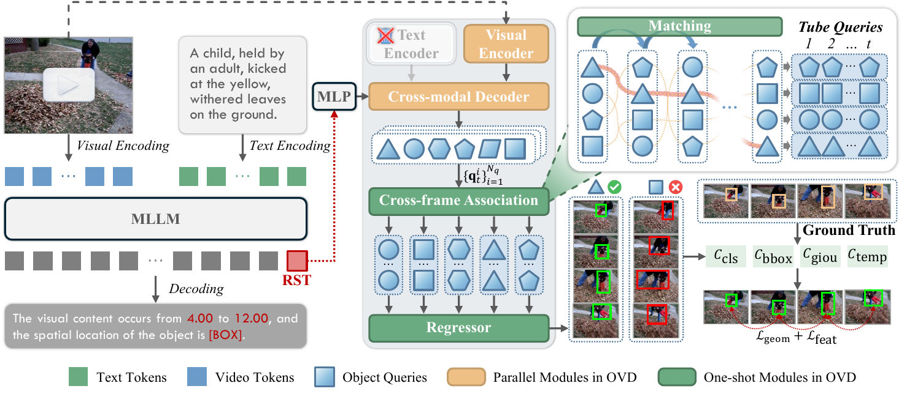

<div align="center">

# Detector-Empowered Video Large Language Model for Efficient Spatio-Temporal Grounding

### ACM MM 2026

<a href='https://github.com/gaostar123/DeViL'></a>
<a href='http://arxiv.org/abs/2512.06673'></a>
<a href='https://huggingface.co/gaostar/DeViL-7B'></a>
</div>

<p align="center"><i>DEViL offloads dense spatial grounding from the MLLM to a fully-parallelizable detector, achieving strong STVG performance with superior efficiency while preserving the backbone's general reasoning capacity.</i></p>

<p align="center">
  
</p>


## 📰 News

- <strong>2026-07-12</strong> Congratulations! Our work has been accepted by ACM MM 2026. 🎉🎉🎉
- <strong>2026-05-12</strong> We have open-sourced our model [DeViL-7B](https://huggingface.co/gaostar/DeViL-7B). 🔥🔥🔥
- <strong>2026-05-11</strong> Training and evaluation code is now available in this repository. 🔥🔥
- <strong>2026-05-09</strong>  Our paper is now publicly available on [arXiv](http://arxiv.org/abs/2512.06673).


## 📝 Abstract
Multimodal large language models (MLLMs) are rapidly expanding from general video understanding to finer-grained understanding such as spatio-temporal video grounding (STVG) and reasoning. In these tasks, an MLLM must localize the user-queried target in time and space and take the results as evidence for reasoning. Existing MLLM methods mainly follow two paradigms: (1) Direct Localization, which outputs STVG results with extra alignment modules or specialized decoders; and (2) Candidate-based Selection, which first constructs tube-level candidates and then selects the relevant one with an MLLM. However, both suffer from a <i>serious efficiency bottleneck</i>: the former incurs linearly growing decoding cost as the queried temporal span increases, while the latter relies on costly candidate construction. To break this bottleneck, we propose <strong>DEViL</strong>, a detector-empowered Video-LLM with a simple key idea: <i>offloading dense spatial grounding from the MLLM to a fully-parallelizable, well-trained detector</i>. Specifically, DEViL distills the query into a detector-compatible reference-semantic token, which replaces the detector's text embedding to enable spatial grounding in a single pass. Then, we design temporal consistency regularization to match objects across frames and enforce their coherence over time. In this way, DEViL avoids long coordinate decoding and heavy candidate pipelines. Extensive experiments show that DEViL achieves strong performance (43.1% m_vIoU on HC-STVG) with superior efficiency (14.33 FPS), while preserving the general reasoning capacity of the MLLM backbone.

## 🔎 Framework
<p align="center">
  
</p>

## 🛠️ Requirements and Installation

Please download the following checkpoints before training or evaluation, and place them under `weights/` with the following layout:

- [GroundingDINO Swin-B checkpoint](https://github.com/IDEA-Research/GroundingDINO/releases/download/v0.1.0-alpha2/groundingdino_swinb_cogcoor.pth) -> `weights/pretrained/groundingdino_swinb_cogcoor.pth`
- [VideoLLaMA3-7B](https://huggingface.co/DAMO-NLP-SG/VideoLLaMA3-7B) -> `weights/videollama3_7b_local/`
- [VL3-SigLIP-NaViT](https://huggingface.co/DAMO-NLP-SG/VL3-SigLIP-NaViT) -> `weights/VL3-SigLIP-NaViT/`

```bash
cd DeViL
pip install torch==2.4.0 torchvision==0.19.0 --extra-index-url https://download.pytorch.org/whl/cu118
pip install transformers==4.46.3 accelerate==1.0.1
pip install decord ffmpeg-python imageio opencv-python
pip install -r requirements.txt
pip install flash-attn --no-build-isolation

python devil/model/g_dino/GroundingDINO/ops/setup.py build install
python devil/model/g_dino/GroundingDINO/ops/test.py
```

## 🚀 Training and Evaluation

DEViL uses a three-stage training pipeline. Run the following scripts sequentially:

```bash
# example: 1 node with 8 GPUs
bash scripts/train/stage1.sh 1 8
bash scripts/train/stage2.sh 1 8
bash scripts/train/stage3.sh 1 8
```

For evaluation, run:

```bash
# example: evaluate selected benchmarks with 8 GPUs
bash scripts/eval/eval_video.sh weights/DeViL_stage3 "vidstg,hc_stvg_v1,hc_stvg_v2" 1 8
```

## 🎬 Demo

To run DEViL on your own video, use [demo/demo.sh](demo/demo.sh) as a reference and update `--media_path` and `--query` for your input.


# Citation

If you use our work or our implementation in this repo, or find them helpful, please consider giving a citation in the following format.

```
@article{gao20251+,
  title={1+ 1> 2: Detector-Empowered Video Large Language Model for Spatio-Temporal Grounding and Reasoning},
  author={Gao, Shida and Xue, Feng and Wang, Xiangfeng and Ming, Anlong and Long, Teng and Shao, Yihua and Wang, Haozhe and Lin, Zhaowen and Wang, Wei and Sebe, Nicu},
  journal={arXiv preprint arXiv:2512.06673},
  year={2025}
}
```

# Acknowledgements

We sincerely thank the following projects for their contributions to this work:

- [VideoLLaMA3](https://github.com/DAMO-NLP-SG/VideoLLaMA3)
- [GroundingDINO](https://github.com/IDEA-Research/GroundingDINO) 
